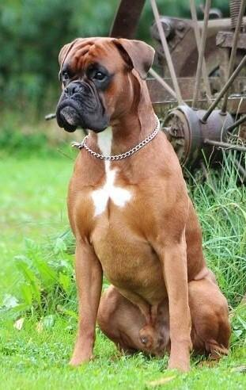
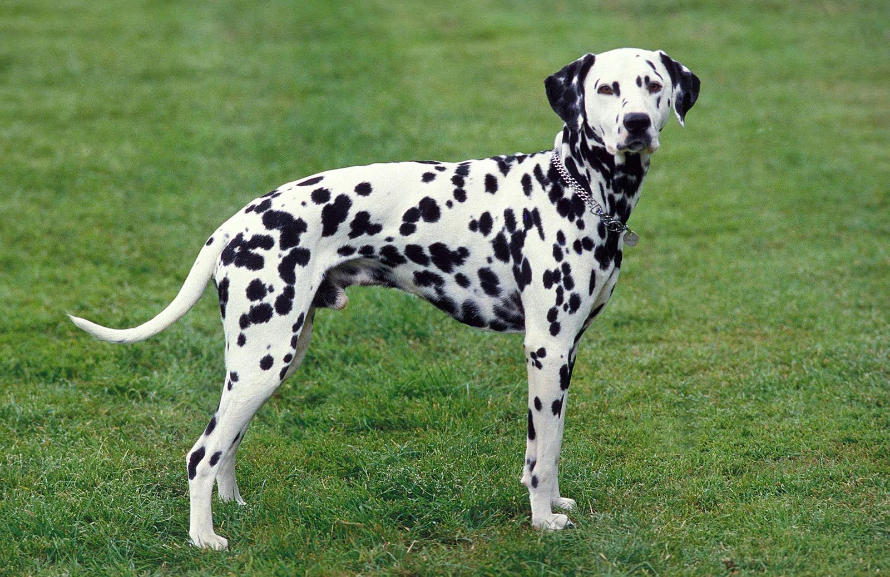
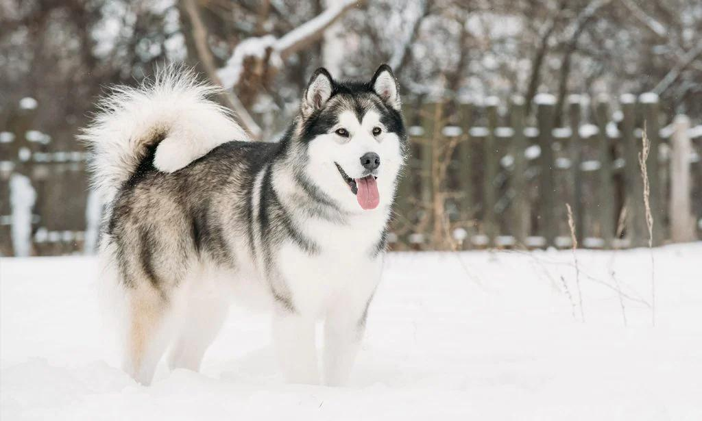
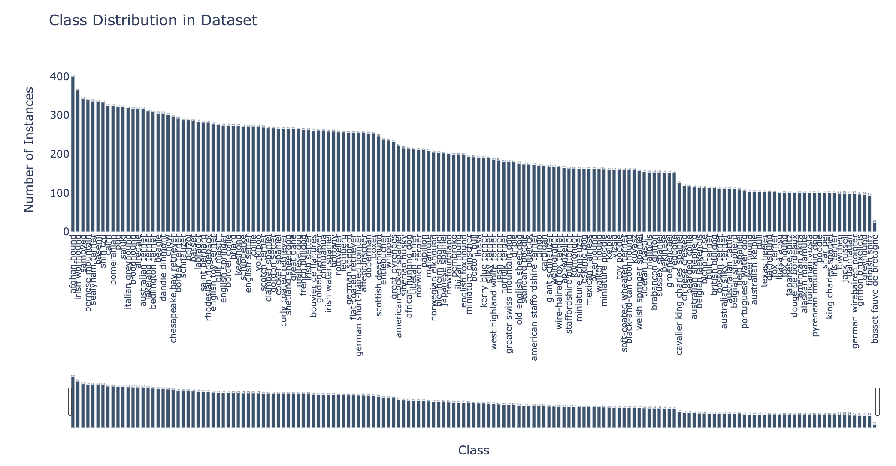

# Распознавание пород собак
Данный проект разрабатывается для определения породы собаки по фотографии. В дальнейшем такая система может быть интегрирована в мобильное приложение или веб-клиент. Основная задача, которая решается: детекция собаки + классификация породы.

Примеры изображений:

## Источники данных
За основу взяты открытые датасеты:
- [Stanford Dogs Dataset](https://www.kaggle.com/datasets/jessicali9530/stanford-dogs-dataset/data).
- [computer-science-gtrnn/dog-breeds](https://universe.roboflow.com/computer-science-gtrnn/dog-breeds-u4eaf)

Чтобы их можно было использовать в дальнейшем обучении все датасеты приведены в формат COCO.

Для обогащения данных используются следующие сайты:
- [dogsindepth.com](https://dogsindepth.com/list_of_all_dog_breeds.html)
- [Dogtime.com](https://dogtime.com/dog-breeds)

Для скраппинга данных были созданы скрипты, они находятся в [`scripts`](scripts/).

## EDA
- Всего изображений в датасете: 30529
- В датасете есть небольшой дисбаланс классов, а особо проблемным является класс **Basset Fauve De Bretagne, он имеет 24 объекта**.
- В данный момент, без учёта дополнительно собранных данных есть **161 класс**.

## Текущие проблемы в данных
- Потенциально могут быть дубликаты изображений как в датасете, так и в новых данных
- Новые данные надо сматчить по классам с основным датасетом

## Где могут использоваться эти данные?
- Детекция собак
- Классификация пород
