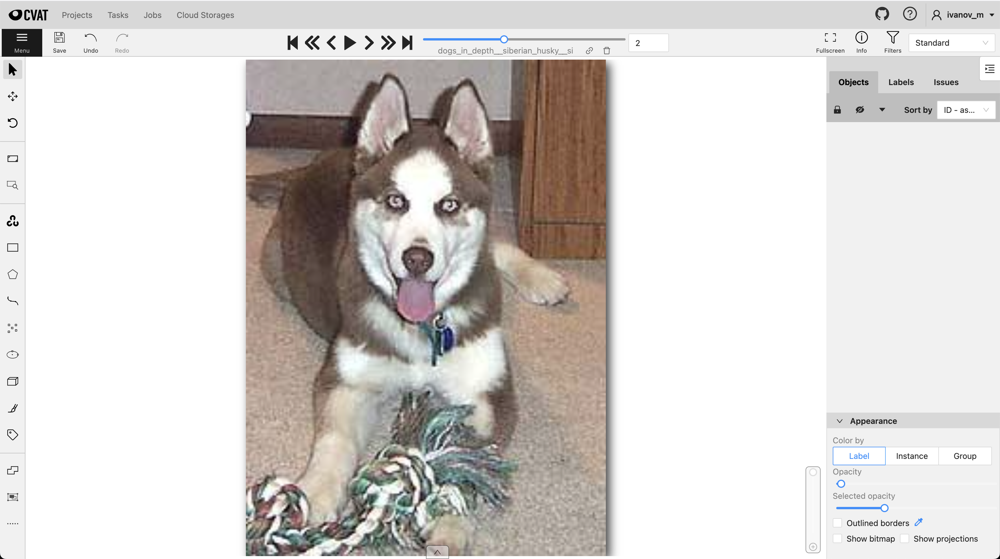
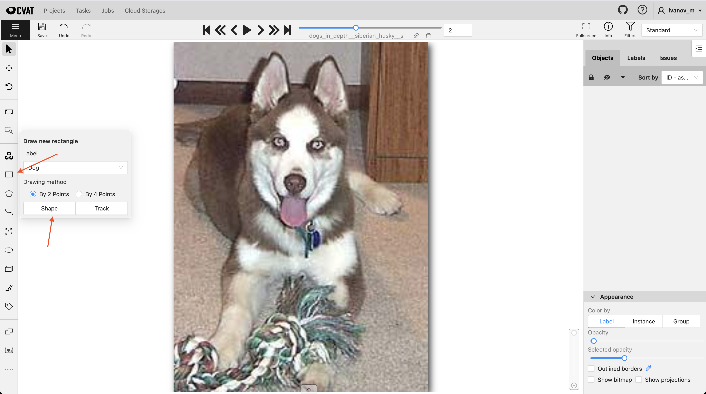
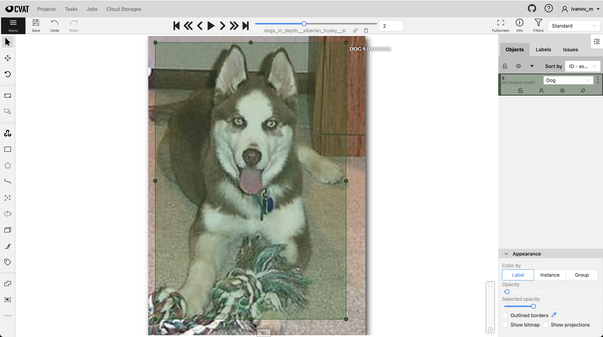
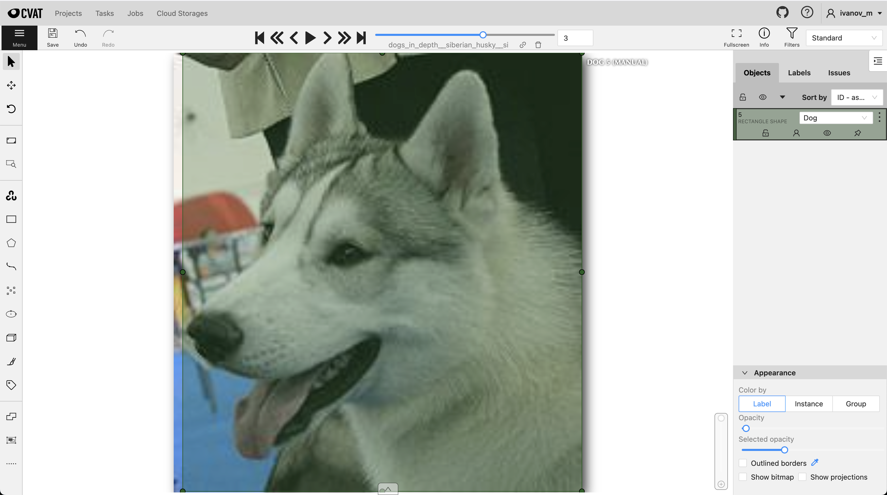
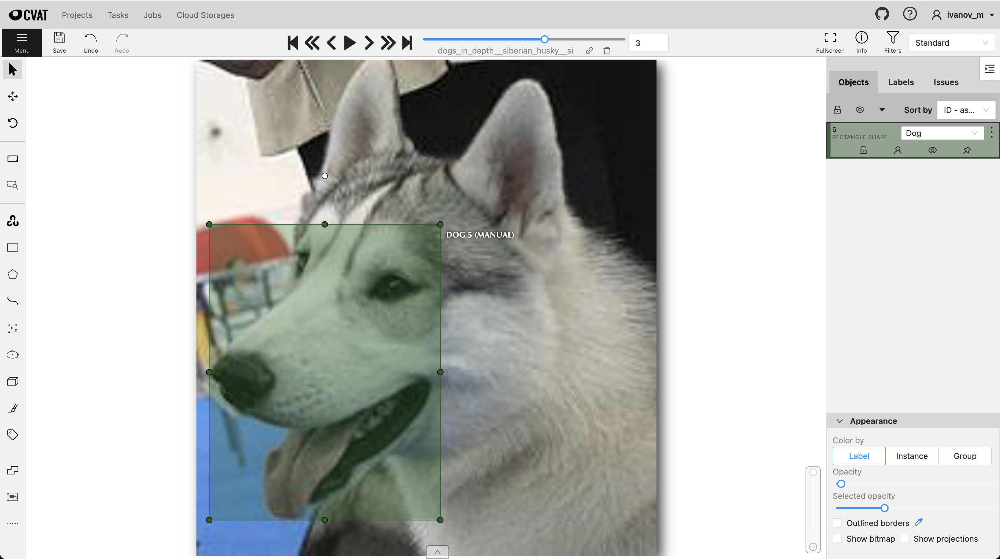
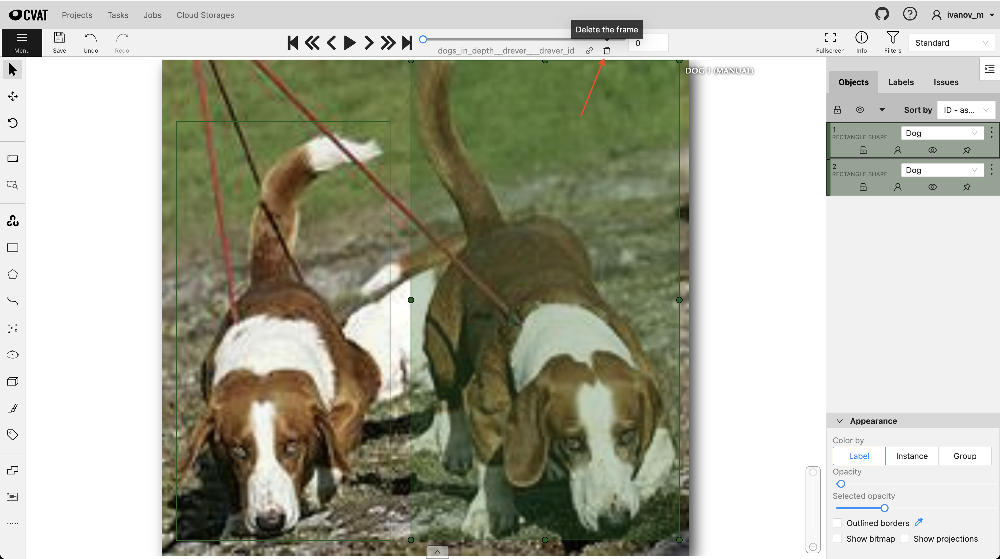

# Техническое задание на разметку данных (Версия 1.2)

## Краткое описание задачи
Мы планируем обучить модель, которая будет находить собак на изображениях. Качество решения конечной задачи зависит от данных, поэтому прошу внимательно ознакомиться с данной инструкцией.

## Как размечать?
1) Заходим на платформу CVAT по ссылке, которую вам отправили `http://192.168.201.10:8080/tasks/.../jobs/...`. Вы увидете перед собой окно разметки.

2) Чтобы начать разметку, **нажмите N** или **найдите в левой панели прямоугольник и нажмите shape в выпадающем меню**

3) Поставьте точку сначала в **левом верхнем** углу объекта, а затем в в **правом нижнем**

Объект выделен и разметка сохранена.

## Правила выделения объектов
- Необходимо выделять собаку полностью

    Правильный вариант
    
    Неправильный вариант
    

- Обводить объект следует как можно ближе к собаке (погрешность 7 пикселей)

    Правильный вариант
    
    Неправильный вариант
    

- Если собака предствлена на изображении частично, то обводим всё что видим до края изображения

    Правильный вариант
    
    Неправильный вариант
    

- Если **собак на изображении несколько**, то следует **удалить** такой пример из разметки ([Как удалить объект из разметки?](#как-удалить-пример-из-разметки))
    
    Неправильный вариант
    
    Тоже неправильный вариант
    

- Если на изображении **нет собак**, то следует **удалить** такой пример из разметки ([Как удалить объект из разметки?](#как-удалить-пример-из-разметки))

### Как удалить пример из разметки?
Чтобы удалить пример из разметки с помощью инструмента, который расположен под ползунком прогресса разметки в верхней части экрана

